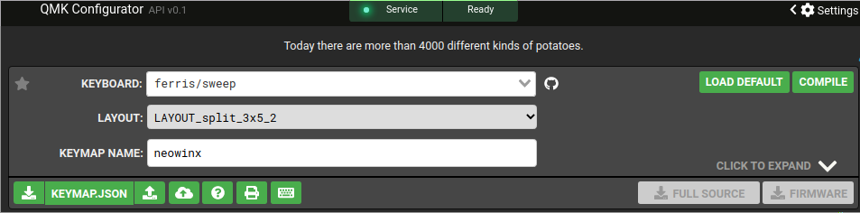
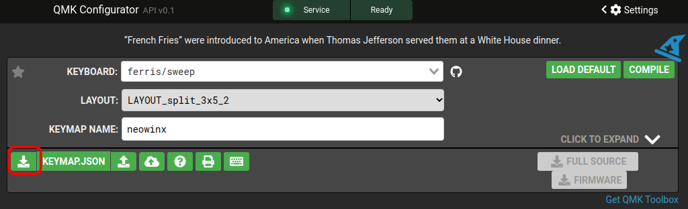
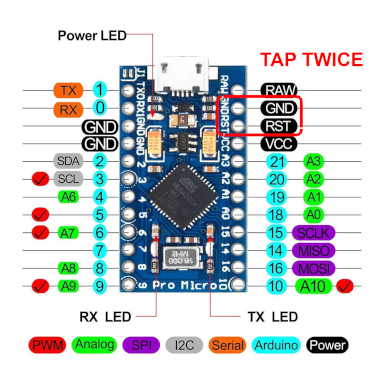

# QMK Ferris Sweep Firmware Layout

This repository contains my layout configured with the [QMK Configurator](https://config.qmk.fm)

## Prerequisites

- [QMK](https://docs.qmk.fm/#/newbs_getting_started)

## How to Use

### 1 - Load and edit the keymap

Go [QMK Configurator](https://config.qmk.fm/#/ferris/sweep/LAYOUT_split_3x5_2) web and on **KEYBOARD** select `ferris/sweep` and on **LAYOUT** select `LAYOUT_split_3x5_2`



Then upload the `neowinx.json` file using the upload button


Edit the layers and keys to your needs and then proceed to the next section to flash your keyboards

### 2 - Obtain the .hex file

You have two options to get the compiled firmware.

#### - Download the firmware directly from QMK Configurator

Once you have edited the layout, layers, etc. you can download the `hex` (or `bin`) file directly from QMK Configurator and use this to flash your micro controller

First compile the firmware using the **COMPILE** option. When the compilation process finish, the **FIRMWARE** button will be available, click it to start downloading the `hex` (or `bin`) file

#### - Download the keymap json from QMK Configurator and compile it using qmk to obtain the firmware binary file

Once you have installed `qmk`, click on the **Download this QMK Keymap JSON file** button in **QMK Configurator** and then copile it using the `qmk` compile command



```bash
qmk compile neowinx.json
```

The firmware (usually an .hex file) should be on your *$QMK_HOME* (usually `$HOME/qmk_firmware`)

### 3 - Flash your micro controller

> IMPORTANT!!!
> 
> If your'e flashing your microcontroller for the first time, please **set the correct headedness** issuing the commands described [here](https://github.com/qmk/qmk_firmware/tree/master/keyboards/ferris/sweep#setting-handedness)
> or YOU WILL have issues configuring it, or even BRICK YOUR MICRO CONTROLLER if you're not careful

Now, flash your micro controller on bootloader mode with that file

```bash
qmk flash $HOME/qmk_firmware/ferris_sweep_neowinx.hex
```

You should see qmk asking you to put your keyboard on bootloader mode

```bash
Flashing binary firmware...
Please reset your keyboard into bootloader mode now!
Press Ctrl-C to exit.
```

In my case, I have a [Pro Micro (Type-C)](https://www.google.com/search?q=pro+micro+type+c), so tapping twice (two times in quick sucesion) `RST` pin with `GND` pin with a cable, twissers, etc.
puts it on bootloader mode



QMK should detect this and start writing the firmare


```bash
avrdude: AVR device initialized and ready to accept instructions
avrdude: device signature = 0x1e9587 (probably m32u4)
avrdude: Note: flash memory has been specified, an erase cycle will be performed.
         To disable this feature, specify the -D option.
avrdude: erasing chip
avrdude: reading input file $HOME/qmk_firmware/ferris_sweep_neowinx.hex for flash
         with 20036 bytes in 1 section within [0, 0x4e43]
         using 157 pages and 60 pad bytes
avrdude: writing 20036 bytes flash ...

Writing | ################################################## | 100% 1.50 s 

avrdude: 20036 bytes of flash written
avrdude: verifying flash memory against $HOME/qmk_firmware/ferris_sweep_neowinx.hex

Reading | ################################################## | 100% 0.16 s 

avrdude: 20036 bytes of flash verified

avrdude done.  Thank you.
```

and that's it

for more information, please read the [QMK Documentation](https://docs.qmk.fm/#/newbs_flashing)

### Have fun

neowinx
