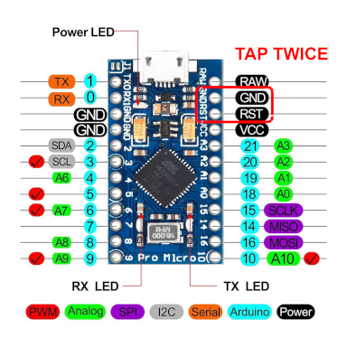

# QMK Ferris Sweep Firmware Layout

This repository contains my layout configured with the [QMK Configurator](https://config.qmk.fm)

## Prerequisites

- [QMK](https://docs.qmk.fm/#/newbs_getting_started)

## How to Use

Once you have installed `qmk`, compile the keymap exported from the [QMK Configurator](https://config.qmk.fm)

```bash
qmk compile neowinx.json
```

The firmware (usually an .hex file) should be on your `QMK_HOME`.

> IMPORTANT!!!
> 
> If your'e flashing your microcontroller for the first time, please **set the correct headedness** issuing the commands described [here](https://github.com/qmk/qmk_firmware/tree/master/keyboards/ferris/sweep#setting-handedness)
> or YOU WILL have issues configuring it, or even BRICK YOUR MICRO CONTROLLER if you're not careful

Now, flash your micro controller on bootloader mode with that file

```bash
qmk flash $HOME/qmk_firmware/ferris_sweep_neowinx.hex
```

You should see qmk asking you to put your keyboard on bootloader mode

```bash
Flashing binary firmware...
Please reset your keyboard into bootloader mode now!
Press Ctrl-C to exit.
```

In my case, I have a [Pro Micro (Type-C)](https://www.google.com/search?q=pro+micro+type+c), so tapping twice (two times in quick sucesion) `RST` pin with `GND` pin with a cable, twissers, etc.
puts it on bootloader mode



QMK should detect this and start writing the firmare


```bash
avrdude: AVR device initialized and ready to accept instructions
avrdude: device signature = 0x1e9587 (probably m32u4)
avrdude: Note: flash memory has been specified, an erase cycle will be performed.
         To disable this feature, specify the -D option.
avrdude: erasing chip
avrdude: reading input file /home/pflores/qmk_firmware/ferris_sweep_neowinx.hex for flash
         with 20036 bytes in 1 section within [0, 0x4e43]
         using 157 pages and 60 pad bytes
avrdude: writing 20036 bytes flash ...

Writing | ################################################## | 100% 1.50 s 

avrdude: 20036 bytes of flash written
avrdude: verifying flash memory against $HOME/qmk_firmware/ferris_sweep_neowinx.hex

Reading | ################################################## | 100% 0.16 s 

avrdude: 20036 bytes of flash verified

avrdude done.  Thank you.
```

and that's it

for more information, please read the [QMK Documentation](https://docs.qmk.fm/#/newbs_flashing)

### Have fun

neowinx
